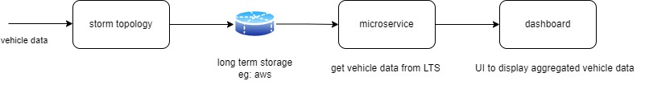
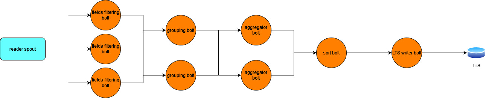

# uber-cab-count-aggregator

## About
This project aims at giving a count of the cabs running at a given place at a given point in time. This helps in finding the location with the largest cluster of vehicles.

## Design
## Overview

Storm topology depicted in the picture above reads the vehicle data off of the Uber API and processes the data to find the location which has the highest number of vehicles. The topology then writes the data to a long term storage system (LTS).

## Storm Topology

The storm topology depicted in the above picture consists of several components. They are as follows:

###1. Reader Spout
The reader spout reads the data off of Uber API and emits that data as tuples.

###2. Fields Filtering Bolt
The fields filtering bolt filters the only required fields for performing the aggregations and sends them off to the grouping bolt.
 
 
**Note:** The 3 instances of fields filtering bolt is to depict the parallelism factor for that bolt. The same applies to the rest of the bolts.

###3. Grouping Bolt
The grouping bolt groups the input tuples based on the location field.

###4. Aggregator Bolt
The aggregator bolt aggregates and emits the count value as a new field in the outgoing tuple.

###5. Sort Bolt
The sort bolt sorts the tuples based on the location field in the decreasing order of the count of vehicles.

###6. LTS Writer Bolt
The final stage of the processing where the transformed data is written to a long term storage system.

## Scope
The scope of this project is limited to the development of the storm topology which reads and processes the vehicle data. The development of the microservice and dashboard are further enhancements to the current project which will be implemented later.